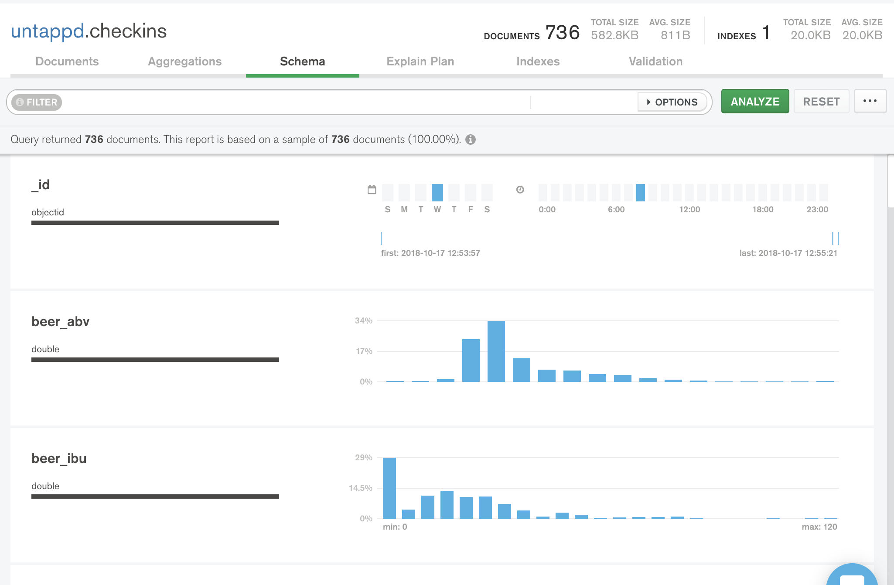

# MongoSampler

This example is similar to what Compass will do but instead of sampling the collection, it will use the whole collection. 

For performance considerations visit [the npm page](https://www.npmjs.com/package/mongodb-schema).

# Use
Edit `index.js` to put in database, collection, and connection string. Then run the `index.js` and the output will look similar to [SampleOutput.json](SampleOutput.json) for a given collection whose documents look like [SampleDoc.json](SampleDoc.json).

The `removeValues` boolean will determine whether to pass back all possible values or not.